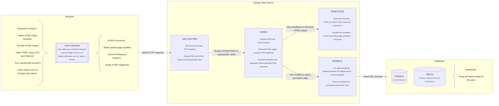

# 📘 Blue-Booking Web Application 📘
[Bluebooking](https://thealexandrian.net/wordpress/40005/roleplaying-games/ptolus-running-the-campaign-bluebooking) is a traditional TTRPG technique which allows for role-playing outside of the main game sessions. Historically, it involved sharing a notebook between players where they would write out in-character notes and scenes between their character and NPCs. Today, it is more commonly done via chat services.

This web application allows for online bluebooking within an TTRPG group. It functions similarly to a blogging service.

## 📋 Table of Contents
1. Tech Stack
	- [Frontend](#frontend)
	-  [Backend](#backend)
		- [Packages](#packages-with-important-functionality)
	- [Database](#database)
	- [Testing and QA](#testing-and-qa)
2. Startup Guide
	- [How to run locally?](#how-to-run-locally?)
	- [How to run via Docker?](#how-to-run-via-docker?)
3. Contribution Guide
	- [Workflow](#workflow)
	- [Project Structure](#project-structure)
		- [Branches](#branches)
		- [File Structure](#file-structure)
		- [Testing Structure](#test-structure)

## ⚙️ Tech Stack
This project uses Django+HTMX to implementation the blue-booking web application. Here is the architecture of the application:

### Frontend
- **HTML** – Standard markup language for web pages.
- **CSS + Tailwind CSS** – CSS is the standard styling system for the web, while Tailwind CSS provides a set of CSS styles that makes styling faster and more consistent.
- **HTMX** – Extension of HTML which allows for dynamically updating parts of an HTML page without requiring a full page reload.
- **TypeScript** – A typed superset of JavaScript that improves editor support and allows for earlier error detection during development.
### Backend
- **Django** – Python web framework responsible for request handling, business logic, rendering templates, and interacting with the database.
#### Packages with Important Functionality
- **django-htmx** – Adds additional utility functions for creating HTMX code and handle HTMX code in Django.
- **django-allauth** – Allows for easy, standardised authentication.
### Database
- **SQLite** – Lightweight file-based database used during development.
- **PostgreSQL** – Fast and modern production database.
### Testing and QA
- **pytest + pytest-django** – Testing framework.
- **coverage** – Measures the coverage of tests.
- **pylint + pylint-django** – Checks code quality and style.
- **black** – Checks and enforces code formatting.

## 🚀 Startup Guide
<details>
<summary>How to run locally?</summary>

#### 1. Clone the repository
```bash
git clone https://github.com/CaptainSpaceCadet/blue-booking-app.git
cd blue-booking-app
```
#### 2. Create a virtual environment
If using Linux or MacOS:
```bash
python -m venv venv
source venv/bin/activate
```
If using windows:
```bash
python -m venv venv
source venv\Scripts\activate
```
#### 3. Install dependencies
```bash
pip install -r requirements.txt
```
#### 4. Set up .env file
Create a `.env` file in the project root. Link to a SQLite or Postgres database depending on your preference.
```env
SECRET_KEY=your-secret-key-here
DEBUG=True
DATABASE_URL=sqlite:///db.sqlite3
```
#### 5. Apply database migrations
```bash
python manage.py migrate
```
#### 6. Run the web application
```bash
python manage.py runserver
```
The web application should be available at `http://localhost:8000` in your browser.

</details>

<details>
<summary>How to run using Docker?</summary>

#### 1. Clone the repository
```bash
git clone https://github.com/CaptainSpaceCadet/blue-booking-app.git
cd blue-booking-app
```

#### 2. Run the web application
```bash
docker compose up --build
```
The web application should be available at `http://localhost:8000` in your browser.
</details>

## 🤝 Contribution Guide
### Workflow
#### 1. Identify a feature to develop or a bug to fix
Create an issue associated with a feature or bug you plan to implement or fix.
#### 2. Create a branch from `develop`
Create a branch on which you will implement the feature or fix the bug. Name the branch based on this repository's [variation of conventional branch format](https://github.com/CaptainSpaceCadet/blue-booking-app/blob/main/docs/branch-conventions.md).
#### 3. Commit to your branch
Commit your changes to the branch using the [conventional commit format](https://github.com/CaptainSpaceCadet/blue-booking-app/blob/main/docs/commit-conventions.md). In the commit body the issue number of your issue, for example `#1`.
#### 4. Write tests for new feature (optional)
If you implemented a new feature, write unit tests for every new function or class.
- Write more detailed description of test structure TBD.
#### 5. Run tests and code quality assurance
##### Tests
Run all tests and verify they pass:
```bash
pytest
```
All tests must pass successfully.
##### Coverage
Run tests with coverage reporting:
```bash
coverage erase
coverage run -m pytest
coverage report
```
The total coverage should be above 80%. To view a detailed HTML report:
```bash
coverage html
```
Open htmlcov/index.html in your browser.
##### Code Quality
Run pylint to check the code quality:
```bash
pylint blue_booking_app
```
Follow the instructions to improve the code. The final linting score should be above 8.0/10.0.
##### Code Style
Reformat the entire project into `black` style.
```bash
black blue-booking-app
```
Or reformat an individual file.
```bash
black example.py
```
#### 6. Create pull request
Should all the tests pass create a pull request, requesting the merging of your feature branch into the develop branch. 
#### 7. Merge pull request
Once your pull request has been approved it will attempt to be merged automatically into the `develop` branch. GitHub Actions automatically run the tests when merging, should these tests fail the merge will be rejected.
#### 8. Pull `develop` into `main`
Periodically representing the final releases of the app, the progress in `develop` will be pulled to `main`. Should everything go right, your feature or bug fix will be included.
### Project Structure
#### Branches
- **`main`** – Production-ready code. Only merged from `develop` for releases.
- **`develop`** – Integration branch. All features and fixes merge here.
- **`feature/*`** – New features. Branch from `develop`, merge back to `develop`.
- **`fix/*`** – Non-urgent bug fixes. Branch from `develop`, merge back to `develop`.
- **`hotfix/*`** – Urgent production fixes. Branch from `main`, merge to both `main` and `develop`.
#### File Structure
- File structure TBD
#### Testing Structure
- Testing Structure TBD
