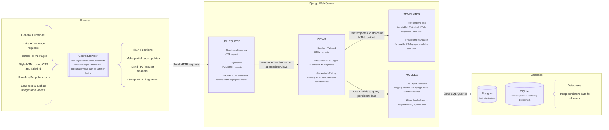
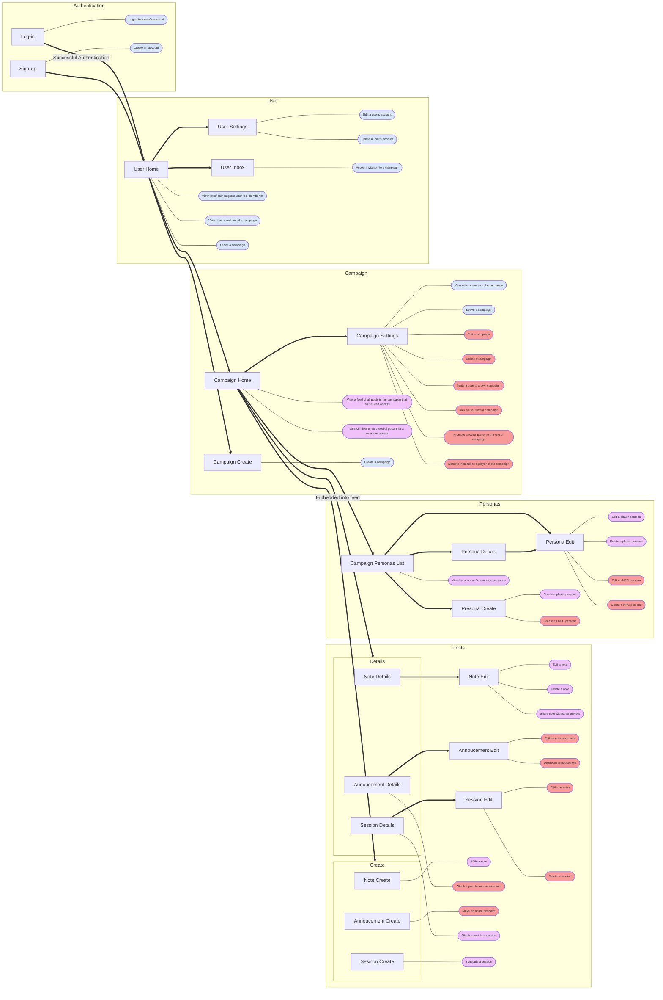
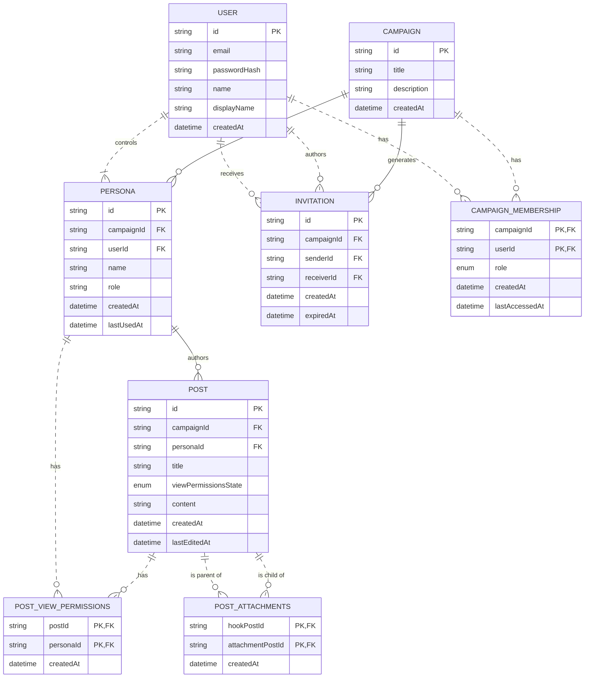

# Bluebooking Website Proposal Sketch
- This proposal sketch is an extension of the [[Bluebooking Proposal]]
- It will only cover the mandatory functionality laid out in the [[Bluebooking Proposal]]
	- Primarily the blogging use-cases will be discussed while the optionally chat use-cases will be ignored
- The project will use all-auth for authorisation which comes with some pre-built data structures
### Description
[Bluebooking](https://thealexandrian.net/wordpress/40005/roleplaying-games/ptolus-running-the-campaign-bluebooking) is a traditional TTRPG technique which allows for role-playing outside of the main game sessions. Historically, it involved sharing a notebook between players where they would write out in-character notes and scenes between their character and NPCs. Today, it is more commonly done via chat services.

This web application allows for online bluebooking within an TTRPG group. It functions similarly to a blogging service.

## Main user actions
###### Any user can:
- Create an user account
- Log-in to their account
- Edit their user account
- Delete their user account

- View a list of campaigns they are a member of
- View other members of a campaign they are a member of
- Accept invitation to a campaign
- Leave a campaign

###### Any player (including GM) can:
- View a list of all posts such as notes, announcements and sessions they can access
- Search or filter list of all posts they can access

- Write their own note
- Edit their own note
- Delete their own note
- Share notes with other players or GM

- Attach a post to a session

- View a list of the user's campaign personas
- Create a player persona
- Edit their player persona
- Delete their player persona

###### The GM can:
- Create a campaign (becoming the GM of the campaign)
- Edit their campaign
- Delete their campaign

- Invite a user to their own campaign
- Kick user from a campaign

- Promote another player to the GM role within the campaign
- Demote themself to the player role within the campaign

- Make an announcement
- Edit an announcement
- Delete an announcement
- Attach a post to an announcement

- Schedule a session
- Edit a session
- Delete a session

- Create a NPC persona
- Edit their NPC persona
- Delete their NPC persona

### Notes
- Posts are any type of user content
	- They can be announcements, sessions or notes
- The posts a user has access to is displayed in a user's feed
	- The posts in this feed are paginated
	- The feed is by default sorted from newest to oldest
- Posts in a Feed can by sorted by:
	- Time (newest-to-oldest or oldest-to-newest)
- Posts in a Feed can be filtered by:
	- A basic text search
	- A date range
	- Player, character or NPC involvement
	- Whether it is an as-player post or as-character post
	- Post type such as note, session and announcement
- Announcements are associated with a date, author, title and text contents in markdown
	- Author will always be GM however future extensions might allow GM to change
- Sessions are an extension of announcements, with the title automatically set to "Session [date]"
	- Posts that are not announcements themselves can be linked to an announcement by the GM
		- Anyone can link posts to a session announcement
- Notes are associated with a date, author, text contents in markdown
	- Notes are by default dated to the time of creation but they can be post or pre-dated.

## Data Model
The application should have the following data entities:
- Campaign, an entity representing a bluebooking group where users within the group can interact with each other. It is limited to 24 members.
- User, an entity representing the users of the application. It can have the role of GM or Player. It must be a member of ONE Party.
- Persona, an entity representing a persona of a User. It can be the player's main character or the NPC of the GM but it can also be the User's actual identity for out-of-character conversations. The persona's should have role representing whether it is a player, a character or a NPC.
- Post, an entity representing user generated content. It has a date, a title, an author (Persona) and text content as well as a list of users that can access it. It can be:
	- An announcement where by default the GM is the author and every User in the Party can access it.
	- An session where by default the GM is the author, every User in the campaign can access it and it's title includes "Session".
	- A note where by default it's only accessible by its author and the GM and the title field is empty.

## User Interface
- The user's feed should be the first page displayed past login.
- As-player or as-character or as-NPC posts should be displayed differently.
- Date-based filtering should be easy to use from the UI.
- Each character should be assigned a colour to use with their posts.
- Pagination should be clearly visible for posts.

## Main Architecture

## Main User Flow

## Main Data Entities

